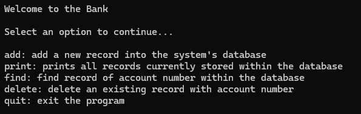

This banking database is an application that I created in my prgram structure class. In this course, all assignments and projects were done in a unix using Vim. This application features a user interface on the front end that enables users to interact with the database on the back end. The functions allow the user to add/create a record, delete the record and search for a specific record stored within the bank's database. The database utilizes linked lists to store user information and dynamic memory allocation allowing for efficent and flexible memory usage. 

Here is an image of the User Interface:

This project includes multiple files such as headers and source code files linking with each other allowing the user interface to fully access functions from the backend. The project was done alone, but created in such a way that could easily be accessed and worked on in a group environment such as the utilziation of comments and debugging. Through this project, I developed a confidence in C and C++ especially with the utiliation of pointers, file operations (read and writefiles) and proper memory usage. Although the original project was done in C, we also had to recreate the project in C++ demonstrating my knowledge in both languages. 

Source: <a href="https://github.com/hoangv11/BankDatabaseC">Bank Database in C</a>

Source: <a href="https://github.com/hoangv11/BankDatabase2">Bank Database in C++</a>
