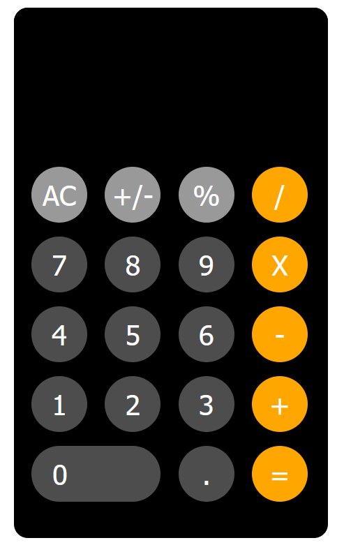

During the summer, I decided to introduce myself to JavaScript, HTML and CSS in preparation of my Software Engineering class for the upcoming semester. I learned these langauges through wathcing youtube videos and some free online websites that offered courses on these langauges. Using what I learned, I created a copy of the IOS calculator that can take a user's input, and perform operations to calculate a result. 

For this project, I used HTML which creates a live server on a website displaying the calculator. I utilized CSS to create the display of the calculator to match that of the calculator on IOS and finally used some JavaScript to make the calculator functionable. Overall, this project got me started on the basics of HTML, CSS and JavaScript. 

Here is what the calculator looks liked launched on the HTML website server: 

Source: <a href="https://github.com/hoangv11/Calculator">Click Here</a>
